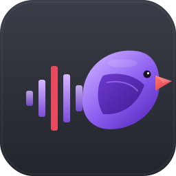
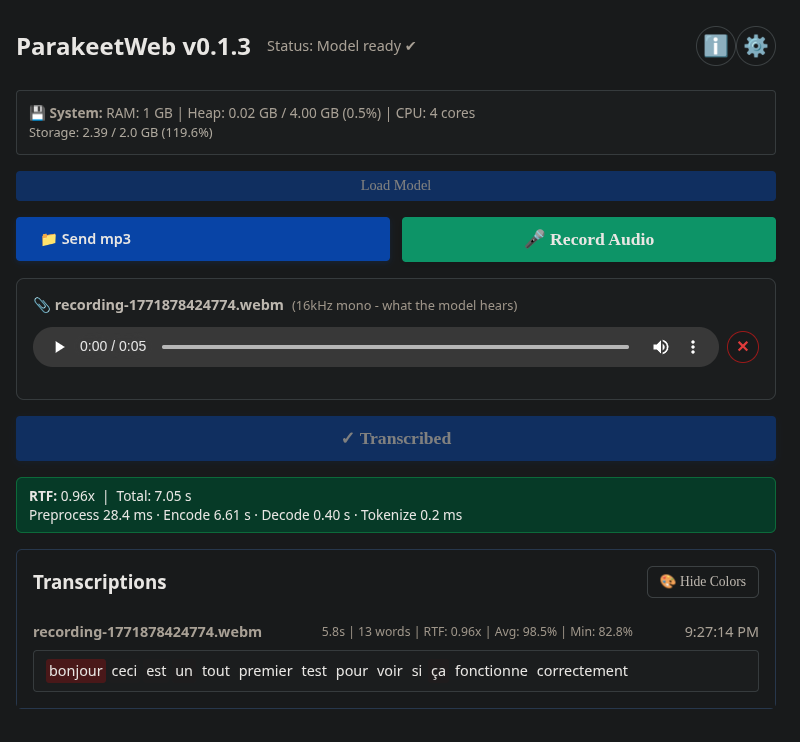

<p align="center">
  
</p>

# Parakeet Web

> ⚠️ **EXPERIMENTAL WIP** – Made with care but with AI. Expect bugs, breaking changes, and rough edges.

**Try it now: [parakeetweb.olicorne.org](https://parakeetweb.olicorne.org/)** — no installation required.

---

## Table of Contents

- [Features](#features)
- [Quick Start](#quick-start)
- [Dictation Mode](#dictation-mode)
- [Dictation Devices (SpeechMike)](#dictation-devices-speechmike)
- [Live Transcription](#live-transcription)
- [Phrase Boosting](#phrase-boosting)
- [Remote Microphone (Phone as Mic)](#remote-microphone-phone-as-mic)
- [Local Model Fallback](#local-model-fallback)
- [Mobile debugging](#mobile-debugging)
- [Architecture](#architecture)
- [License](#license)
- [Acknowledgments](#acknowledgments)
- [Credits](#credits)

---

Browser-based speech-to-text running entirely client-side using NVIDIA's [Parakeet TDT 0.6B v3](https://huggingface.co/nvidia/parakeet-tdt-0.6b-v3) model (converted to ONNX format by [istupakov](https://huggingface.co/istupakov/parakeet-tdt-0.6b-v3-onnx)) via WebGPU/WASM.



## Features

| Feature | Details |
|---|---|
| 🔒 **100% Private** | Runs entirely in your browser — no audio ever leaves your device |
| ⚡ **WebGPU Accelerated** | Fast GPU inference with automatic WASM fallback for compatibility |
| 🎙️ **Phone as Mic** | Use your phone as a wireless microphone via end-to-end encrypted WebRTC |
| ⏱️ **Live Transcription** | Optional streaming mode: text appears as you speak, dictation regex applied in real time |
| 🎯 **Phrase Boosting** | Bias the decoder toward your own list of phrases (names, jargon, drug names, acronyms), with optional per-phrase weights. Runs fully client-side |
| 🔦 **Beam Search** | Optional multi-hypothesis decoding (file transcription) that lets phrase boosting recover words greedy would discard; width 1 (greedy) stays the default |
| 📝 **Dictation Mode** | Post-processes transcriptions with regex rules (medical French vocabulary, punctuation, units) |
| 🕐 **Word Timestamps** | Per-word timestamps and confidence score heatmap |
| 📁 **File or Mic** | Transcribe uploaded audio files or record directly from your microphone |
| 🎚️ **Capture Controls** | Per-recording toggles for noise suppression, echo cancellation, and auto gain control |
| 🌐 **Bilingual UI** | Interface available in English and French, auto-selected from your browser language (the underlying model itself is multilingual) |
| 📦 **Automatic Quantization** | Encoder precision follows the backend automatically: fp32 on WebGPU (accurate), int8 on WASM (smaller, required by the browser's blob-fetch limit); the decoder always runs int8 |
| 🐳 **Docker Ready** | One-command self-hosted deployment |

> **Planned:** as it matures, I want to eventually add support for [WEBCAT](https://github.com/freedomofpress/webcat/) (Web-based Code Assurance and Transparency) for even stronger security guarantees, so you can cryptographically verify that the code running in your browser is the code that was actually published.

## Quick Start

```bash
# 1. Copy the example env file and edit it with your own values
cp docker/env.example docker/.env

# 2. Run the demo locally with Docker
sudo docker compose -f docker/docker-compose.yml up
```

3. Then visit `http://localhost:5173`

## Dictation Mode

Parakeet Web includes an **experimental dictation mode** that post-processes transcriptions using regex rules to clean up spoken punctuation, medical vocabulary, and unit abbreviations. This is especially useful for French medical dictation.

The regex rules are sourced from the [murmure-regex repository](https://framagit.org/interhop/murmure-regex) by the non-profit [interhop.org](https://interhop.org/), originally created for the [Murmure](https://github.com/Kieirra/murmure) software. A single combined CSV file is automatically downloaded on container startup.

The rules are in French and cover categories like punctuation, unit abbreviations, clinical exam templates, medication name corrections, and medical vocabulary corrections.

This feature is very early and will improve rapidly.

### How it works

- **Docker**: The entrypoint script downloads the single combined `regex.csv` file from the [murmure-regex repository](https://framagit.org/interhop/murmure-regex) on every container start.
- **Frontend**: The app loads the CSV rules at startup via a manifest file and applies them as JavaScript `RegExp` replacements. After regex processing, each line is stripped of leading/trailing whitespace and its first letter is capitalized. Three display modes are available per transcription: **Raw**, **Confidence** (heatmap), and **Dictation** (regex-cleaned).
- **Custom regex source**: Set the `DICTATION_REGEX_SOURCE` environment variable to override the default Murmure URL. This can be a GitLab-compatible repo URL (e.g. `https://framagit.org/interhop/murmure-regex`) or a local folder path containing CSV regex files (e.g. `/path/to/my/regex-csvs`). This allows you to iterate on regex rules locally without waiting for upstream changes.

## Dictation Devices (SpeechMike)

Parakeet Web supports physical dictation devices (Philips SpeechMike and similar) via [GoogleChromeLabs/dictation_support](https://github.com/GoogleChromeLabs/dictation_support). The device's RECORD, PLAY/PAUSE and STOP buttons control the in-app recording lifecycle:

- **RECORD**: start a new recording (ignored while already recording; use PLAY to pause/resume instead).
- **PLAY**: pause or resume the current recording.
- **STOP**: stop the recording (or start a new one when idle).

Pair the device once via the **Connect Dictation Device** button in settings; on subsequent visits the page auto-reconnects with no extra click.

> **Browser limitation:** this feature uses the [WebHID API](https://developer.mozilla.org/en-US/docs/Web/API/WebHID_API), which is currently only available in **Chromium-based browsers** (Chrome, Edge, Brave, Opera, Vivaldi, ...). Firefox and Safari do not implement WebHID, so the physical buttons cannot drive the app there. You can still use the device as a regular USB microphone in any browser, but you have to start and stop recording with the on-screen controls. On non-Chromium browsers Parakeet Web tries to detect a plugged-in SpeechMike from the audio-input device list and shows a hint pointing you to a compatible browser.

This integration was wired up with [Claude Code](https://www.anthropic.com/claude-code).

## Live Transcription

By default, transcription runs once when you stop recording. If you'd rather see the text appear as you speak, enable **Live transcription** in the settings panel. The model is then re-run every few seconds on a sliding window of recent audio, and the transcript updates incrementally during the recording. The dictation regex (if loaded) is applied to the entire visible text on every update, so corrections like "point virgule" → ";" happen live too.

This works for both the local microphone and the [phone-as-mic](#remote-microphone-phone-as-mic) path — the live transcriber consumes the same audio buffer either way.

### How it works

Parakeet's encoder is non-streaming (it sees the whole window at once with self-attention), so accuracy depends heavily on having enough acoustic context. The live transcriber maintains a sliding **context window** of the last *N* seconds of audio and re-runs the model on it every few seconds. Words near the trailing edge of the window are "pending" (may be revised by the next, larger-context window) and words past a 3-second commit boundary are frozen for good. The result: every word is eventually transcribed with at least 3 seconds of right-context, while you still see updates as you speak.

When you hit stop, the canonical full-audio transcription pass runs as it always has, and its result replaces the live one — so the live mode never affects the final accuracy.

### Settings

- **Live transcription** (off by default): toggle the streaming mode on or off.
- **Context window**: how many seconds of recent audio the encoder sees on each update.
  - **Auto** (recommended): starts at 15 s and adapts itself between **10 s and 60 s** based on how fast your machine actually transcribes. Faster machines get a larger window (more context, better accuracy); slower machines get a smaller one (so updates can keep up).
  - Or pick a fixed value (10/15/20/30/45/60 s) if you want to override the auto-adapter — for example, choose 60 s on a fast desktop to maximize accuracy, or 10 s on a phone to keep latency low.

The cadence (how often the live transcript updates) is always auto-adapted: if a transcription pass takes longer than expected, updates back off so the queue never grows. Enable **Display more details** in settings to see the current window size, step interval, and per-tick processing time below the live transcript.

This feature was implemented with [Claude Code](https://www.anthropic.com/claude-code).

## Phrase Boosting

Speech models reliably mis-hear words they rarely saw in training: personal names, local place names, drug names, niche jargon, acronyms. **Phrase boosting** lets you give the decoder a short list of words and phrases to favor, so acoustically ambiguous audio resolves toward them instead of a more common look-alike.

Open the settings panel and find the **Phrase boosting** group:

- **Boost phrases**: one phrase per line, with up to three optional colon-separated fields (`phrase:WEIGHT:TOPK:CASE`). The full per-line syntax is in the collapsible reference below; the two most common fields are:
  - `phrase:WEIGHT`, e.g. `acetaminophen:2.5`. A positive weight nudges the decoder *toward* the phrase; a **negative** weight pushes it *away* (a penalty), e.g. `um:-3` to suppress a filler word. The valid range is -10 to 10 (nonzero); an out-of-range or zero weight is ignored with an inline warning and treated as 1.
  - `phrase:WEIGHT:TOPK`, e.g. `venlafaxine:5:50`, sets a per-phrase **top-k gate**: the phrase is only nudged when its token is already among the model's top `TOPK` candidates for that step. This keeps boosting a ranking nudge rather than a hammer that can hallucinate a phrase the model never considered. Default top-k is 25.
- **Boost strength**: a global multiplier applied on top of every phrase's weight. Ranges from -10 to 10; set it to 0 to disable boosting without clearing your list. A negative strength inverts every phrase at once (boosts become penalties).

Your phrase list and strength are saved locally (IndexedDB) and survive reloads. Like everything else in this app, boosting runs **100% in your browser**: nothing about your phrases is sent anywhere.

**Operator-provided lists (optional, self-hosted):** set the `BOOST_PHRASES_SOURCE` environment variable to a local folder of `.txt` files (one phrase per line, same per-line syntax as the box) or to an https URL pointing at a single `.txt` file. When at least one list is found, a selector appears above the box so users can pick which list to load; choosing one fills the box with that file's contents. The selector always includes a **Custom** entry for typing your own phrases, and that custom text is saved across sessions independently of the loaded files. A served list can ship pre-tuned by carrying its own default strength on a `#!strength N` line, and very large lists can be precompiled to `.pwc` files so visitors' browsers skip the encode step (see the collapsible reference below). When the variable is unset, no selector is shown and the box works exactly as described above (manual entry only).

<details>
<summary><strong>Full per-line syntax, how boosting works, and precompiled lists</strong></summary>

#### Per-line syntax

Each line is `phrase` followed by up to three optional colon-separated fields, `phrase:WEIGHT:TOPK:CASE`:

- `WEIGHT` (default 1): the boost weight, -10 to 10 (nonzero). Positive nudges *toward* the phrase, negative *away* (a penalty). Out-of-range or zero is ignored with an inline warning and treated as 1.
- `TOPK` (default 25): the per-phrase top-k gate; the phrase is only nudged when its token is already among the model's top `TOPK` candidates for that step.
- `CASE`: force casing for this one phrase, `s` (case-sensitive) or `i` (case-insensitive, matches every casing). Omit to use the default.

Leave an earlier field empty to keep its default while setting a later one, e.g. `venlafaxine::50` keeps weight 1 but sets top-k 50, and `venlafaxine:5:50:i` sets all three.

A served list can carry its own default strength on a `#!strength N` line (N in -10 to 10): loading that list forces the strength slider to N, so a curated list ships pre-tuned.

#### How it works

This is a browser port of the *concept* behind NVIDIA NeMo's [GPU-Accelerated Phrase-Boosting](https://github.com/NVIDIA-NeMo/NeMo/pull/14277) (see also issue [#14772](https://github.com/NVIDIA-NeMo/NeMo/issues/14772)). Each phrase is tokenized with a faithful reimplementation of the model's BPE tokenizer and inserted into a token-level **boosting trie**. During decoding, before each token is chosen, the trie adds an additive reward (shallow fusion) in **logit space** to the tokens that would start or continue one of your phrases, with deeper matches rewarded a little more to encourage finishing a phrase once it starts. Adding to a logit is the principled log-domain nudge: it multiplies that token's probability before the softmax renormalizes, rather than crudely scaling the final probability. A **top-k gate** keeps the reward honest: a token is only boosted when its raw logit is already among the model's top candidates for that step (default 25, configurable per phrase), so a strong weight nudges the ranking without forcing a word the model never considered. A negative weight applies the same reward with the opposite sign, penalizing the phrase instead.

By default this app decodes **greedily** (one best token per step), so boosting is best-effort: it biases each step toward your phrases, but it cannot recover a phrase the greedy decoder already discarded on an earlier frame. Raising the **Beam Width** setting (file transcription only; see below) lets the decoder keep several competing hypotheses, so a boosted phrase can survive in a lower-ranked beam until the audio confirms it, which is exactly the case greedy cannot recover. Beam search costs roughly Nx the decode time for width N, so width 1 (greedy) stays the default. Boost strength helps too, but very large values can distort otherwise-correct text, so start small and increase only as needed. Accented Latin text and ligatures (e.g. `isotrétinoïne`, `sœur`) are fully supported. Scripts the tokenizer has no tokens for (e.g. Chinese/Japanese/Korean) collapse to a single unknown token and cannot be boosted; such phrases are automatically skipped and listed in an inline warning rather than silently ignored. This is a tokenizer limitation, not a bug.

#### Precompiled lists (`.pwc`, self-hosted only)

When `LOCAL_MODEL_PATH` is set, the container encodes each operator-provided list to token ids at boot so visitors' browsers skip that work. That encode still runs on **every** container start, which is slow for a very large (10k-100k phrase) list. To avoid it, precompile the list once:

```bash
node scripts/compile-boost.mjs my-list.txt --model-dir /path/to/model
```

(use the same model folder you mount at `LOCAL_MODEL_PATH`) and drop the resulting `my-list.pwc` next to `my-list.txt` in your `BOOST_PHRASES_SOURCE` folder. The container then reuses the `.pwc` verbatim at boot instead of re-encoding, as long as its vocab signature matches the model. If the model (hence vocab) differs, the stale `.pwc` is silently ignored and the `.txt` is re-encoded, so a mismatched `.pwc` is never wrong, only skipped. `.pwc` reuse is local-folder only (the single-URL form always re-encodes).

</details>

This feature was implemented with [Claude Code](https://www.anthropic.com/claude-code).

## Remote Microphone (Phone as Mic)

No local microphone? Use your phone as a wireless mic via WebRTC. Audio is end-to-end encrypted (ECDH P-256 + AES-GCM-256) — the server only relays encrypted data and never sees the plaintext audio.

1. Click the **Phone Mic** button in the app
2. A QR code appears — scan it with your phone
3. Grant microphone permission on the phone
4. **Verify the short code** that appears on both screens matches — read it aloud or compare visually. If the codes differ, click **Codes differ – abort** on either device. This step defends against a malicious signaling server that could otherwise swap encryption keys to MITM the supposedly end-to-end channel. The Confirm button is disabled for 3 seconds (with a visible countdown) so a reflexive Enter/Space press cannot auto-accept a tampered code without you actually reading it.
5. Speak — encrypted audio streams to the computer in real time
6. Click **Stop** on either device — the audio is transcribed normally

### Requirements

- **Local network only**: works out of the box with no extra config (STUN-only / direct P2P).
- **Over the internet**: requires a [coturn](https://github.com/coturn/coturn) TURN relay. A commented-out coturn service is included in `docker/docker-compose.yml` — uncomment it and set `TURN_SERVER`, `TURN_SECRET`, and `TURN_EXTERNAL_IP` in `docker/.env`. If you already run coturn (e.g. for [WebSend](https://github.com/nicMusic/websend) or Nextcloud Talk), point to it and reuse the same `TURN_SECRET`.
- **Restrictive networks (last resort)**: when both direct WebRTC and TURN/TURNS are blocked (some corporate proxies strip UDP and the TURNS CONNECT upgrade), the signaling sidecar can forward the encrypted audio frames itself, over WebSocket (preferred) or HTTP long-poll. After the SDP exchange the client races WebRTC and the relay in parallel for ~10 s: WebRTC wins if it gets through, otherwise the relay takes over and the peer connection is torn down. Audio stays AES-256-GCM end-to-end, so the relay only ever sees ciphertext (it is purely a transport fallback). Enabled by default; toggle with `RELAY_ENABLE` (server) and `VITE_RELAY_ENABLE` (client).

See `docker/env.example` for all configuration options.


## Local Model Fallback

If HuggingFace is blocked or unreachable in your environment, you can serve
model weights directly from the container. Pick any host folder, populate
it with the ONNX files, bind-mount it into the container, and set
`LOCAL_MODEL_PATH` to the matching in-container path:

```bash
# 1. Populate any host folder with the ONNX files (flat layout):
hf download istupakov/parakeet-tdt-0.6b-v3-onnx \
    --local-dir /host/path/to/onnx-files
```

```yaml
# 2. In docker/docker-compose.yml, add a volume:
volumes:
  - /host/path/to/onnx-files:/models:ro
```

```bash
# 3. In docker/.env, set:
LOCAL_MODEL_PATH=/models
```

Caddy serves whatever is at `LOCAL_MODEL_PATH` under `/models/`. The
container crashes at startup if `vocab.txt` is missing, so
misconfigurations are caught early.

Use `VITE_MODEL_SOURCE` to choose where the UI fetches weights from:

- `hf` (default): HuggingFace only.
- `local`: instance-served `/models/` only, HuggingFace is never contacted.
- `both`: HuggingFace first, silent fallback to `/models/` if HF is
  unreachable.

When `LOCAL_MODEL_PATH` is set and `VITE_MODEL_SOURCE` is left unset, it
is auto-promoted to `both`.

The container runs as UID 1000. If your files end up unreadable to UID
1000, run `chmod -R a+rX /host/path/to/onnx-files` (or
`chown -R 1000:1000 /host/path/to/onnx-files`).

Built with [Claude Code](https://claude.com/claude-code).

## Mobile debugging

Append `?debug=1` to any URL to load the in-page [eruda](https://github.com/liriliri/eruda)
devtools — useful for inspecting console logs and network requests on a phone
where you cannot open desktop devtools. Eruda is vendored locally (served
from same-origin with SRI), so nothing is fetched from a CDN at runtime.

Examples:

- Main app: `https://your-host/?debug=1`
- Remote-mic page: `https://your-host/remote-mic.html?debug=1#ROOMID:SECRET`
  (the room info is in the hash fragment, so `?debug=1` goes before the `#`)

Without `?debug=1`, no devtools surface is shipped to the user.

## Architecture

For a file-by-file map of the codebase (the inference engine, the UI, the
signaling server, Docker packaging and the test suite) see
[ARCHITECTURE.md](./ARCHITECTURE.md).

## License

AGPLv3 – See LICENSE file

## Acknowledgments

- **[ysdede/parakeet.js](https://github.com/ysdede/parakeet.js)** – Original project this is forked from
- **[nvidia/parakeet-tdt-0.6b-v3](https://huggingface.co/nvidia/parakeet-tdt-0.6b-v3)** – The underlying ASR model by NVIDIA
- **[istupakov/parakeet-tdt-0.6b-v3-onnx](https://huggingface.co/istupakov/parakeet-tdt-0.6b-v3-onnx)** – ONNX conversion of the model
- **[istupakov/onnx-asr](https://github.com/istupakov/onnx-asr)** – Python reference implementation
- **ONNX Runtime Web** – Makes browser inference possible

## Credits

This fork is based on **[ysdede/parakeet.js](https://github.com/ysdede/parakeet.js)** – all the heavy lifting and original implementation credit goes there. This would not exist without their excellent work.

